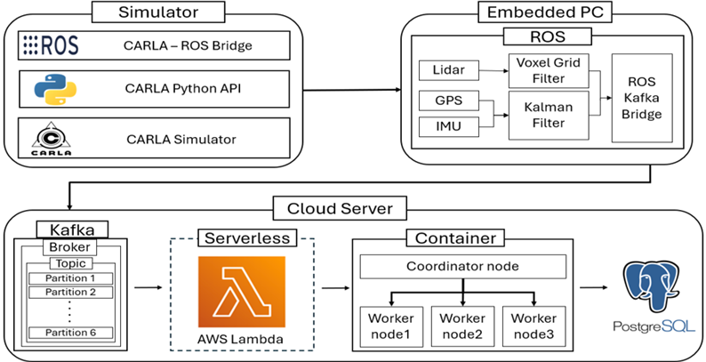
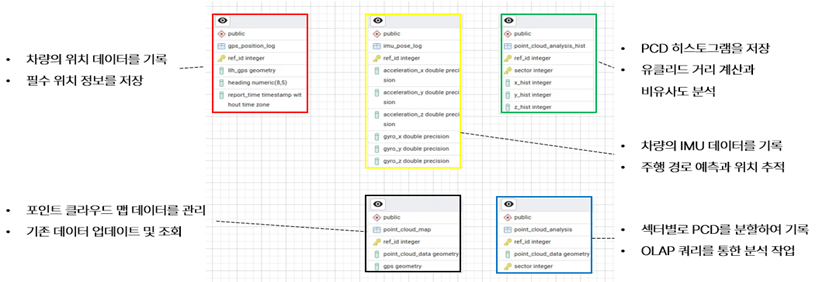
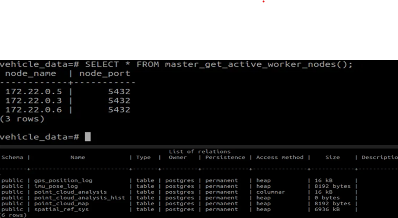

# 2024-2학기 드림학기제 Cloud-Innovators 팀

---

## 🚗 프로젝트 주제
+ 엣지-클라우드 협업을 통한 자율주행차량 센서데이터 수집 및 저장 파이프라인 구축

## 🛠️ 프로젝트 소개

AWS 기반 클라우드 환경에서 자율주행 차량의 센서 데이터를 실시간으로 저장하고 관리하는 데이터 파이프라인 시스템을 개발합니다.

CARLA 시뮬레이터를 활용하여 생성된 자율주행 차량의 센서 데이터를  
**ROS - Kafka - AWS Lambda - PostgreSQL DB** 로 이어지는 데이터 파이프라인을 통해  
클라우드에서 효율적으로 수집·저장·관리할 수 있는 엣지-클라우드 협업 구조를 구현

AWS EC2 서버 내에서 **Docker 기반 분산 데이터베이스** 아키텍처를 설계하고 구축함으로써,  
차량-엣지-클라우드 간의 데이터 흐름과 협업 구조를 심층적으로 이해할 수 있도록 하였습니다.

---

## 🗓️ 개발 기간
+ 2024.09 ~ 2024.12

## 📊 전체 SW 아키텍처



---

## 🗂️ DB 테이블 구현



---

## 🗄️ 분산 DB 구축



## 🗂️ 데이터 파이프라인 구성

```plaintext
CARLA Simulator
     ↓
ROS
     ↓
Kafka
     ↓
AWS Lambda
     ↓
AWS EC2 Server (Docker 기반)
     ↓
PostgreSQL Database


